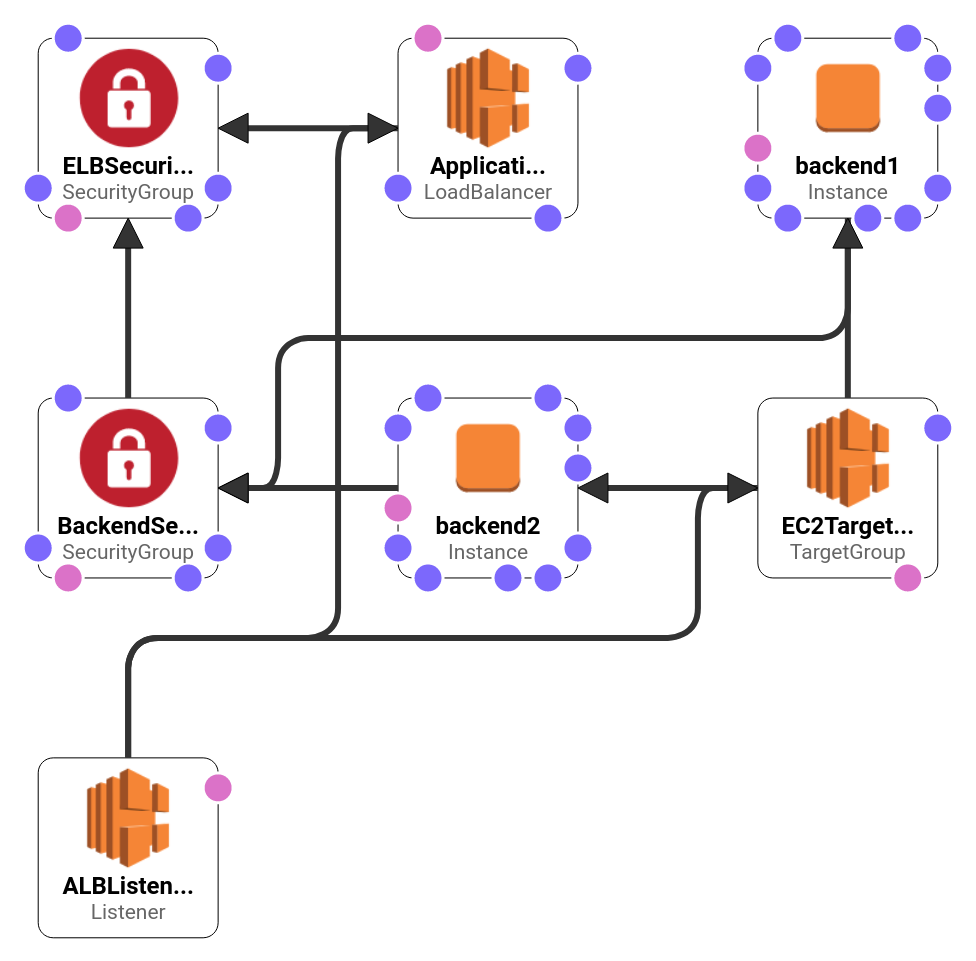

This repo contains template for creating load balancer using 2 EC2 instances with CloudFormation. It does not create custom VPC network due to limitations of AWS free tier. Instead it allows to choose default vpc network and subnet ids for each backend as parameter during creation of stack. 

